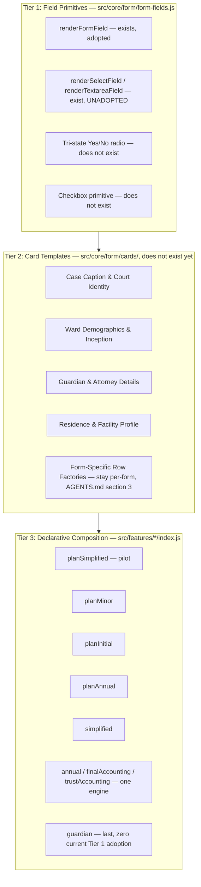

# Milestone 41: Centralized Field Definitions, Shared Card Templates, and Declarative Form Architecture

## Status

**41-1 landed 2026-09-13** — see its own "What landed" section, appended
after §2's "41-1: Tier 1 completion" plan. **41-2 landed 2026-09-13** — the
Cover page's two cards and the Signatures page's Guardian identity card are
built and wired into Plan Simplified; see "What landed so far: Cover page
cards" and "What landed next: Signatures page card — 41-2 complete." The
milestone's fourth named card (Residence & Facility Profile) was
deliberately not built — Plan Simplified has no such fields to verify it
against; see that section's closing note. **41-3 is in progress**: Plan
Minor and Plan Initial (2 of 6) are landed — see their own "What landed"
sections under §2's "41-3: Tier 3 rollout" plan. Remaining: Plan Annual,
Simplified Accounting, Annual Accounting (covers Final/Trust), Guardian
Inventory.

This proposal outlines an architectural refactoring to unify form
construction across the codebase into a 3-tier hierarchical system:
**Field Primitives → Card Templates → Form Composition**, the same target
`AGENTS.md` §9 already names.

**Revision (2026-09-13):** every claim below was re-verified directly against
current `master` (after Milestone 42's full A–H series landed) rather than
carried over from the original draft. The verification changed the plan
materially, not cosmetically — see "What changed in this revision" below.
Where the original draft's framing was corrected rather than merely updated,
that is called out in place, per this repository's convention for recording
proposal-accuracy corrections rather than silently fixing them.

---

**Related, independent delivery:** `MILESTONE-41B-PROPOSAL.md` covers an
unrelated, much smaller task also queued under Milestone 41 — consolidating
the sidebar's four save/backup buttons down to two now that Milestone 40F
unified the underlying export/import pipeline. No shared files with the
3-tier work below; it can be approved and implemented independently, in
either order relative to this document.

**Prerequisites — satisfied.** Milestone 42's four *Precedes 41* sub-deliveries
have landed and gone green: 42B (green `npm test` baseline), 42C (the
`window.*` bridge inventory and freeze), 42D (one form-write side-effect
path for all nine filing types), 42F (validators emitting structured
`{path, section, message}` issues). This milestone may now be approved.

---

## What changed in this revision

The original draft's motivating claim — "atomic field rendering is
*partially* centralized" — undersold how far centralization already went,
in one specific and important way, and undersold how much work remains in
another. Both change the execution plan:

1. **`inpS()` (`legacy-app.js`) already delegates to `renderFormField()`
   (Tier 1) at runtime, today, on every call.** Its body is:
   ```js
   function inpS(id,label,val,req=false,type='text'){
     if (typeof window !== 'undefined' && typeof window.renderFormField === 'function') {
       return window.renderFormField({ path: id, label, value: val, type, required: req, id });
     }
     // ~40 lines of an inline duplicate implementation, below
   ```
   `main.js` imports `form-fields.js` eagerly and (since Milestone 40G) runs
   before any page mounts, so `window.renderFormField` is always defined by
   the time `inpS()` is ever called — the duplicate 40-line fallback below
   the `if` is dead in the running app, a defensive branch that never fires,
   not a live second implementation. This means **Tier 1 already renders
   every one of `inpS()`'s ~90 call sites** across all four Plan types
   (`plan-annual`, `plan-initial`, `plan-minor`, `plan-simplified`) and
   `simplified-accounting`'s own `inpS`-wrapping helper — they just reach it
   through a narrower, positional-argument call shape instead of
   `renderFormField`'s object form. Migrating these is a call-site ergonomics
   change, not a rendering-path risk: the fields are already Tier 1 output.
   **`txtP()`, `radioP()`, and `chkP()` do not have this delegation** — each
   is still a fully independent, hand-rolled implementation. This is the
   real, proven template for Tier 1 completion: extend the same
   `if (typeof window.renderX === 'function') return window.renderX(...)`
   pattern to the other three, in each function's own body, with zero
   call-site changes at first — exactly how `inpS()` already works.

2. **Two of Tier 1's four primitives are built and have zero adoption.**
   `renderSelectField()` and `renderTextareaField()` exist in
   `form-fields.js`, are covered by `tests/unit/form-fields.spec.js`, and are
   called by **nothing else in the app** — confirmed by a repo-wide search.
   `txtP()` (~20 call sites across the four Plan types) duplicates
   `renderTextareaField()` outright. No `<select>`-shaped primitive is
   adopted anywhere either, despite existing.

3. **Guardian Inventory (`src/features/guardian-inventory/index.js`, 1,209
   lines, the largest and most structurally distinct filing type) has zero
   Tier 1 adoption** — it calls neither `inpS()` nor `renderFormField()`
   anywhere; every field is hand-rolled with its own `data-bind` markup.
   This is the highest-effort, highest-risk migration target in the
   milestone and should be scheduled last, not folded into a generic
   "roll out to all nine types" step.

4. **No tri-state radio or checkbox primitive exists in Tier 1 at all**, but
   the fragmentation this milestone would close is large and precisely
   countable, not the vague "partially centralized" of the original draft:

   | Pattern | Where | Call sites | Fieldset/legend? |
   | --- | --- | --- | --- |
   | `yesNoRadioHTML()` (+ `yesNoRadioAnnualHTML()` thin wrapper) | `legacy-app.js` | 9 + 5 | Yes — already compliant |
   | `radioP()` | `legacy-app.js`, called from 4 Plan types | 7 | **No** — `<label>`/`<div>` only, no `<fieldset>` |
   | `chkP()` | `legacy-app.js`, called from all 4 Plan types | ~25 | N/A (checkbox, not radio) |
   | `yesNoCheckboxS()` | `legacy-app.js` | ~25 | N/A (checkbox) |
   | `yesNoCheckboxD()` | `legacy-app.js` | 4 | N/A (checkbox) |
   | Guardian Inventory D-3 (hand-rolled, not via any shared helper) | `guardian-inventory/index.js` | 2 groups | Yes — fixed directly in Milestone 40H-C |

   `AGENTS.md` §6's rule ("binary radio pairs write string `'Yes'`/`'No'`
   and must be wrapped in semantic `<fieldset>`/`<legend>`") is **true for
   `yesNoRadioHTML()` and the Guardian Inventory D-3 sites, false for
   `radioP()`'s 7 call sites** — this milestone is where that rule stops
   being aspirational for the one remaining exception.

5. **SSN masking is duplicated six ways**, not centralized-with-stragglers:
   `form-fields.js`'s own `renderFormField()` implementation, plus
   independent hand-rolled `ssn-mask-wrap`/`ssn-reveal-btn` markup in
   `guardian-inventory/index.js`, `plan-annual/index.js`,
   `plan-initial/index.js`, `plan-minor/index.js`, and `legacy-app.js`'s own
   `inpS()`-adjacent dead fallback branch (item 1 above).

6. **Milestone 42 landed new infrastructure this plan should build on, not
   duplicate**, all nonexistent when the original draft was written:
   - `src/core/filing/filing-descriptor.js` exports `FILING_TYPE_KEYS`,
     `FILING_ENGINE_IDS`, and `DESCRIPTORS` (42G) — Tier 3 composition and
     any registry-driven iteration belongs here, not a new list.
   - `src/core/form/form-contract.js`'s `runFieldWriteSideEffects(path,
     control)` (42D) is the one shared post-write tail (county commit,
     Party write-through, autosave, nav dots, ward card, name sync) already
     unifying what happens *after* a field commits, across all three
     existing binding conventions (`data-form-path`, `data-annual-path`,
     `data-bind`). Tier 1 does not need to re-solve this; it needs to
     converge every migrated field onto the one binding convention
     (`data-form-path`) that already has the cleanest path to it, so
     `data-annual-path` and `data-bind` can eventually retire (§1, Tier 1,
     below).
   - `src/core/validation/validation-issue.js` (42F) means every validator
     issue already carries an exact `path` (e.g. `planGuardians.0.signatureDate`).
     Tier 1 field primitives must emit `data-form-path` values that are
     byte-identical to the paths validators already state, not a
     independently-invented attribute scheme — this makes
     `focusFieldByPath()`'s jump-to-field work automatically for any newly
     migrated field, for free.
   - `tests/e2e/validation-structured-paths.spec.ts` (42F) and
     `tests/unit/window-bridge.spec.js` (42C) are the real names of the two
     guards this milestone must keep green — the original draft cited
     `tests/unit/validation-path-conversion-oracle.spec.js`, which was a
     transitional file name from mid-migration and does not exist (that
     file was rewritten into the `.spec.ts` name above once the migration
     it was proving completed). `tests/unit/filing-type-enumeration-guard.spec.js`
     (42G) is a third guard worth naming: Tier 3 composition must not
     reintroduce a fourth place that lists all nine filing-type keys.

---

## 1. Architectural Motivation & 3-Tier Hierarchy



All nine filing types are covered above via their seven distinct
`engineId`s (`FILING_ENGINE_IDS` in `filing-descriptor.js`) — `annual`,
`finalAccounting`, and `trustAccounting` share one engine and one
`index.js`, so they migrate together as a single Tier 3 target, not three.

### Tier 1: Field Primitives (`src/core/form/form-fields.js`)

**Current state, verified:** `inferFieldKind`, `renderFormField` (text,
date, money, percent, ssn with mask/reveal, phone, bar number, check
number, account number, zip, address, name, case number — all present and
adopted, directly or via `inpS()`'s delegation), `renderSelectField` and
`renderTextareaField` (present, unadopted). Absent: tri-state Yes/No radio,
checkbox.

**Work**, in the order that reuses proven, low-risk building blocks first:

1. Add a tri-state Yes/No radio primitive by **porting `yesNoRadioHTML()`**
   (already fieldset/legend-compliant, already handles both the
   `data-form-path` and `data-annual-path` binding conventions via its
   existing `binding` parameter) into `form-fields.js`, rather than
   designing one from scratch.
2. Add a checkbox primitive. **Decision needed before implementation,
   flagged here rather than assumed:** `chkP()`, `yesNoCheckboxS()`, and
   `yesNoCheckboxD()` have never been compared for whether they are the same
   semantic shape with different names, or three genuinely different
   behaviors (their names suggest Simplified-specific and
   Guardian-Inventory-D-schedule-specific variants). Audit their three
   bodies before designing one primitive to replace three; do not assume
   they collapse into one shape.
3. Extend `txtP()`, `radioP()`, and `chkP()` with the exact delegation
   pattern `inpS()` already uses: `if (typeof window.render<X> === 'function')
   return window.render<X>({...})`, falling back to today's inline body
   otherwise. This is a same-file, same-signature change with **zero
   call-site edits** at first — the ~52 combined call sites across the four
   Plan types keep calling `txtP(id, label, val, rows, req, hint)` exactly
   as today; only what runs *inside* `txtP()` changes. `radioP()`'s
   delegation to the new tri-state/generic-radio primitive closes its
   fieldset/legend gap as a side effect, not a separate accessibility task.
4. Every Tier 1 primitive's emitted `data-form-path` (or `data-field-path`)
   value must equal the `path` the corresponding `validateX()` call already
   states for that field (verified per field against the real validator,
   not assumed from naming convention) — the design constraint from item 6
   above, made concrete.

### Tier 2: Card Templates (`src/core/form/cards/` — new)

- Case Caption & Court Identity (county picker, case number, circuit).
- Ward Demographics & Inception (name, SSN, inception date, reporting period).
- Guardian & Attorney Details (single/co-guardian identity, bar number, pro
  se detection).
- Residence & Facility Profile (living arrangement radios, address, phone,
  facility type).
- **Collection Grid Boundary** (`AGENTS.md` §3, unchanged): Schedule A
  assets, Plan Q1 residences, and every other collection grid stay on
  form-specific row factories. Cards compose Tier 1 primitives for
  identity/demographic fields only.

### Tier 3: Declarative Form Composition (`src/features/*/index.js`)

- Pages assemble layouts by declaring sequences of Tier 2 cards plus their
  own form-specific row factories, rather than hand-writing inline HTML.
- Lifecycle orchestration (mount/dispose/validation, already extracted per
  feature module) stays exactly where it is; only markup generation moves.
- Iterate filing types via `FILING_TYPE_KEYS`/`DESCRIPTORS` from
  `filing-descriptor.js` wherever a registry-driven list is needed — never
  a new hand-written list of nine (`tests/unit/filing-type-enumeration-guard.spec.js`
  will fail on one).

---

## 2. Execution Plan

Each phase is independently approvable, matching this repository's
established sub-delivery convention (Milestone 40's A–I, Milestone 42's
A–H). Phases 41-1 and 41-2/41-3 have different risk profiles and should be
approved as such, even though they are numbered sequentially here.

### 41-1: Tier 1 completion (low risk — proven delegation pattern, no call-site changes)

**Risk:** Low. `inpS()`'s existing delegation already demonstrates this
exact technique is safe in production.

1. Audit `chkP()` / `yesNoCheckboxS()` / `yesNoCheckboxD()` for shape
   equivalence (Decision, §1 Tier 1 item 2). Document the finding —
   collapse to one primitive only if genuinely the same shape.
2. Port `yesNoRadioHTML()` into `form-fields.js` as the tri-state radio
   primitive; add the checkbox primitive per the audit's finding.
3. Add the delegation branch to `txtP()`, `radioP()`, `chkP()` (or their
   consolidated replacement), mirroring `inpS()`'s exact pattern.
4. Verify with the *existing* test surface first, before writing anything
   new: every `*-mount.spec.ts` (all nine filing types already have one),
   `page-structure.spec.ts` (landmarks/heading structure, all forms),
   `form-field-labels.spec.ts` (accessible names, all forms) must stay
   green with **zero markup diff** for any already-passing assertion — these
   three specs are the pre-existing regression net for exactly this kind of
   change and should be run before any new test is written, not after.
5. Extend `tests/unit/form-fields.spec.js` to cover the two new primitives
   (mirroring its existing per-variant structure) and add
   `tests/unit/form-fields-legacy-delegation.spec.js` (new) asserting each
   of `inpS()`/`txtP()`/`radioP()`/`chkP()` produces markup structurally
   identical to calling the Tier 1 primitive directly with equivalent
   arguments — a permanent guard against the delegation silently drifting,
   not a one-time migration check.
6. Update `TEST-INDEX.md` in the same commit.

No filing type's `index.js` file changes in this phase — the ~140 call
sites across the four Plan types and Guardian Inventory's D-3 are untouched
by design, and stay untouched until 41-2/41-3 converts them to Tier 2/3
composition, if ever (see "What this milestone deliberately does not
require," below).

### What landed (2026-09-13)

**Step 1's audit resolved the flagged "Decision needed":** reading
`chkP()`, `yesNoCheckboxS()`, and `yesNoCheckboxD()` directly found they do
**not** collapse into one shape — they were never three variants of the
same control. `chkP()` is the only genuine checkbox (`type="checkbox"`,
`data-form-value="boolean"`). `yesNoCheckboxS()` and `yesNoCheckboxD()`
are, despite their names, both already thin wrappers that call
`yesNoRadioHTML()` directly — identically to the already-known
`yesNoRadioAnnualHTML()`. So exactly two new Tier 1 primitives were needed,
not three: `renderYesNoField()` (tri-state radio pair, ported verbatim from
`yesNoRadioHTML()`) and `renderCheckboxField()` (ported verbatim from
`chkP()`). A third, `renderRadioGroupField()`, was added for `radioP()`'s
distinct N-option shape (2-way and 3-way, e.g. Plan Minor's visit-frequency
question) — this is the one that intentionally adds the `<fieldset>`/
`<legend>` wrapping `radioP()` never had, closing its accessibility gap as
a side effect of delegation, per the plan's own design.

All four legacy functions (`txtP()`, `chkP()`, `radioP()`,
`yesNoRadioHTML()`) now carry the identical
`if (typeof window.renderX === 'function') return window.renderX(...)`
branch `inpS()` already used in production; `yesNoCheckboxS()`,
`yesNoCheckboxD()`, and `yesNoRadioAnnualHTML()` needed no edits of their
own since they only ever call `yesNoRadioHTML()`. Confirmed call-site
counts by direct grep before touching anything: `txtP()` 23, `radioP()` 7,
`chkP()` 32, `yesNoCheckboxS()` 24, `yesNoCheckboxD()` 3,
`yesNoRadioAnnualHTML()` 5 — all Plan-type and Simplified Accounting pages,
confirming the doc's own ~140-call-site estimate.

**Verification, in the order the plan specified** (existing regression net
before writing anything new): all 7 `*-mount.spec.ts` files (56 tests),
`page-structure.spec.ts`, `form-field-labels.spec.ts`,
`plan-benefits-tristate.spec.ts`, `plan-directive-cards.spec.ts`,
`guardianship-selection-controls.spec.ts`, and the Plan-type sections of
`signature-capture.contract.spec.ts` — 108 e2e tests total, all green with
no new failures. Two guards this milestone must keep green (§3.3) needed a
deliberate update, not a fix: `tests/unit/window-bridge.spec.js` (42C)
flagged the three new `window.render*` globals, requiring
`node scripts/audit-window-bridge.mjs --declare` (regenerates
`window-bridge.d.ts`) and a by-hand addition to the checked-in
`tests/unit/fixtures/window-bridge-allowlist.json` — exactly the deliberate,
reviewed edit that guard exists to force. `npm run verify:data-model`
confirmed unaffected (898 rows, no schema change). New tests:
`tests/unit/form-fields.spec.js` extended with `renderYesNoField`/
`renderRadioGroupField`/`renderCheckboxField` coverage (8 new cases); new
`tests/unit/form-fields-legacy-delegation.spec.js` (6 cases) pins each
legacy function's delegated output as byte-identical to calling its Tier 1
primitive directly, using the same source-slice-and-`new Function`-eval
technique `tests/unit/bar-number.spec.js` already established for this
zero-export, browser-bound file — confirmed as a real regression guard by
temporarily flipping one forwarded argument (`radioP()`'s `required`) and
watching the new test fail on the resulting markup diff, then restoring.
Full unit suite: 760/760 (was 747; +13 new). `TEST-INDEX.md` updated for
both files in the same commit.

### 41-2: Tier 2 cards + pilot (new territory — build once, prove once)

**Risk:** Medium — new markup surface, but scoped to one filing type before
any wider rollout.

1. Build the four Tier 2 cards, consuming Tier 1 primitives from 41-1.
2. **Pilot on Plan Simplified** — the smallest filing type (already the
   pilot for Milestone 42F's validator conversion, for the same reason:
   smallest surface, fastest full-cycle verification, lowest blast radius
   if something is wrong).
3. Verification: `plan-simplified-mount.spec.ts`,
   `signature-capture.contract.spec.ts`'s Plan Simplified section,
   `plan-simplified-parity.spec.js`, `page-structure.spec.ts`, and
   `form-field-labels.spec.ts` all green with no behavior change; a new,
   explicit **text-content diff test** — extract `#main-content`'s visible
   text (labels + values) before and after, for a fixture ward with every
   field populated, and assert byte-for-byte equality. This operationalizes
   the "0 visual diff" requirement the original draft asserted without a
   concrete technique.
4. `tests/unit/form-cards.spec.js` (new): each card binds correctly to
   `data-form-path` and renders required elements, per the original draft's
   own test plan — unchanged, since this test genuinely does not exist yet.

### What landed so far (2026-09-13): Cover page cards

**Direct inspection of Plan Simplified's actual current markup forced a
real design correction before any code was written.** The milestone's own
4-card taxonomy (Case Caption & Court Identity; Ward Demographics &
Inception; Guardian & Attorney Details; Residence & Facility Profile) does
not map 1:1 onto this page's actual visual boxes: Ward Name, Case Number,
and County all render inside ONE "Ward & Case Information" box today, split
across what the taxonomy calls two different cards, while the reporting
period sits in a wholly separate "Reporting Period" box. A card that
insisted on its own heading/box per the taxonomy's literal boundary would
have changed the visible layout — a real regression against the "0 visual
diff" requirement, not a refactor. Resolved by having each card return a
**bare field-group fragment** (no box or heading of its own); the page
keeps every box/heading exactly as it was and places one or more card
fragments inside it. This is also why `renderWardIdentityFields()` and
`renderReportingPeriodFields()` are two independently-callable exports
from `ward-demographics-card.js` rather than one combined function — they
land in two different boxes on this page.

**Also found while designing for later rollout (not corrected now, since
41-2 is scoped to Plan Simplified only):** Plan Minor's own Cover page (per
its `plan-pdf-wcag-compliance.spec.ts` fixture, confirmed in Milestone
43F/43E's own work this session) has no `caseNumber` at all — it uses `ucn`
(Uniform Case Number) and `ref` instead. `renderCaseCaptionFields()` is not
designed to accommodate that divergence yet; whichever 41-3 step migrates
Plan Minor will need its own decision here, not an assumption that this
card works unchanged.

**Built:** `src/core/form/cards/case-caption-card.js`
(`renderCaseCaptionFields()`, Case Number + County, County reused via the
existing `window.countyInputS()` widget since it has no Tier 1 equivalent
and porting one is out of scope) and `src/core/form/cards/ward-demographics-card.js`
(`renderWardIdentityFields()` — name, optional SSN;
`renderReportingPeriodFields()` — period, optional inception date, with
overridable labels for filing types that phrase the period differently).
Optional fields render nothing at all when not passed, rather than an
empty/disabled control, matching Plan Simplified's own current absence of
an SSN or inception-date field. Wired into `pagePlanSCover()` only — the
Signatures page's Guardian/Attorney/Preparer fields are 41-2's next slice,
not yet touched.

**Verification:** confirmed zero visual diff directly, not by inspection —
`git stash push -- src/features/plan-simplified/index.js` to isolate just
the card-wiring change, captured a full DOM snapshot (see below) before and
after with a fixture ward filled, and diffed them: identical. Landed that
snapshot technique as a new shared helper,
`extractFormContentSnapshot()` (`tests/e2e/support/target.ts`), for 41-3 to
reuse — `Element.innerText` alone is not enough for this proof: confirmed
by direct capture that it excludes every `<input>`/`<textarea>`/`<select>`
*value* entirely (they're control state, not text nodes), so a page whose
field values silently changed would still show identical `innerText`. The
helper combines rendered static text with an explicit, DOM-order dump of
every control's value. The verified-identical snapshot is now pinned as a
permanent regression guard in `plan-simplified-mount.spec.ts`; confirmed as
a real guard by temporarily renaming one field's label and watching the
test fail on the resulting diff, then restoring. New
`tests/unit/form-cards.spec.js` (10 cases) covers both cards' `data-form-path`
binding and optional-field omission directly. Regenerated
`window-bridge.d.ts`: `countyInputS` had never been referenced as
`window.countyInputS` before (only ever called as a bare global identifier
elsewhere), so this is its first appearance in the generated declaration —
not a new global, just its first explicit `window.` access site. Full unit
suite: 770/770 (was 760; +10 new). Full targeted e2e:
`plan-simplified-mount.spec.ts`, `page-structure.spec.ts`,
`form-field-labels.spec.ts`, and Plan Simplified's `date-validation
.contract.spec.ts` cases all green.

### What landed next (2026-09-13): Signatures page card — 41-2 complete

**The milestone's own "Guardian & Attorney Details" card name doesn't
survive contact with the real page either**, for a sharper reason than the
Cover page's box/heading mismatch: Guardian, Preparer, and Attorney have
three genuinely different field shapes on this one page.
Preparer/Attorney already use split `street`/`mailingStreet` +
`cityStateZip` fields (not Guardian's single `mailingAddress`), Attorney
alone has a Florida Bar Number field and two email fields, and only
Guardian has Milestone 39's signature-state control (Unsigned/"/s/"/Stamp)
mounted next to its signature-date field. Unifying all three into one
configurable card would either lose fidelity or need config complexity
disproportionate to a single pilot page — scoped down, matching this
session's precedent for exactly this kind of finding (43E Decision 1, 43G
Decision 3).

**What was actually built, and why it's still real, valuable Tier 1
adoption, not a non-event:** Preparer's and Attorney's blocks already call
`inpS()` for every field, which already delegates to `renderFormField()`
as of Milestone 41-1 — they were never the gap. The Guardian block's own
name/phone/email/mailingAddress fields were: entirely hand-rolled raw
`<input>` markup, with no `id`/`for` label association at all and no
`data-field-required` attribute even though the name is genuinely required
for the first guardian — never routed through `inpS()` or
`renderFormField()` at any point in this file's history. New
`src/core/form/cards/guardian-attorney-card.js` exports
`renderPartyNameField()` and `renderPartyContactFields()` (split in two,
not one, because the real layout interleaves them with the signature-date
field and the signature-state control widget — order matters for the
visual-diff proof) and closes exactly that gap. The signature-date field
and the signature-state control itself stay in the page's own composition,
unchanged — they're Milestone 39's lifecycle-bound widget, not a plain
identity field.

Confirmed the label/`id` change is additive-only (a real accessibility
improvement, matching 41-1's `radioP()` precedent), not a regression: the
formatting behavior (`formatName`/`formatPhone`/`formatAddress`, all three
now dropped from this file's `window` destructure as genuinely dead code)
is applied automatically by `renderFormField()`'s own label-based kind
inference, confirmed to match the previous manual calls field-by-field
before removing them.

**Verification, same technique as the Cover page:** `git stash push --
src/features/plan-simplified/index.js` to isolate just this slice's
wiring, captured `extractFormContentSnapshot()` for the Signatures page
with a fixture ward (plus an Attorney name/bar number set directly, since
`fillMinimalValidPlanSimplifiedWard()` doesn't populate the Attorney block)
before and after: identical. Pinned as a second permanent snapshot test in
`plan-simplified-mount.spec.ts`; confirmed as a real guard via a temporary
label change on the Phone Number field, caught, then restored.
`tests/unit/form-cards.spec.js` extended with 3 more cases (13 total) for
the two new exports. Full unit suite: 773/773 (was 770; +3 new). Full
targeted e2e: `plan-simplified-mount.spec.ts` (7 tests, both snapshot pins),
`page-structure.spec.ts`, `form-field-labels.spec.ts`,
`signature-capture.contract.spec.ts`'s Plan Simplified Guardian section,
and Plan Simplified's `date-validation.contract.spec.ts` cases all green.

**41-2 is now complete**: both cards the Cover and Signatures pages needed
are built, wired, and verified. `renderResidenceFacilityCard` (the
milestone's fourth named card) was never built — Plan Simplified has no
residence/facility fields at all (confirmed by reading its full model), so
there was nothing on this pilot page to wire it into or verify it against.
Building it now, unintegrated and unverifiable by this pilot, was
deliberately not done; whichever 41-3 step first migrates a filing type
that actually has these fields (Plan Initial or Plan Annual) is where that
card gets designed against a real page, following this same
verify-before-design discipline.

### 41-3: Tier 3 rollout, ordered by verified risk (not alphabetical or arbitrary)

Smallest and most self-contained first, Guardian Inventory last because it
is the only filing type with zero current Tier 1 adoption and the largest
file (1,209 lines):

1. Plan Minor
2. Plan Initial
3. Plan Annual
4. Simplified Accounting
5. Annual Accounting (covers Final/Trust via the shared `annual` engine —
   one migration, three filing types)
6. Guardian Inventory

Per type: convert to Tier 2/3 composition, then run that type's own
`*-mount.spec.ts`, `page-structure.spec.ts`, `form-field-labels.spec.ts`,
and (where one exists) `*-parity.spec.js`, plus the same text-content diff
technique from 41-2 extended to that type's own maximally-filled fixture.
Each type is its own commit and its own checkpoint — do not batch two
filing types into one commit, per this repository's established discipline
for exactly this shape of rollout (Milestone 39-C's per-role rollout,
Milestone 42F's per-type validator conversion).

### What landed (2026-09-13): Plan Minor

**Confirmed, and now actually resolved, the divergence flagged as a known
open decision when 41-2 landed**: Plan Minor has no `caseNumber` field at
all (it uses `ucn` + `ref`), in a Cover-page field order (Ward Name,
County, UCN, Case #) that doesn't match `case-caption-card.js`'s or
`ward-demographics-card.js`'s fixed field sequence. Rather than force a
mismatch, those fields were left exactly as they already were — genuinely
already on Tier 1 via `inpS()`'s Milestone 41-1 delegation, just not
wrapped in a Tier 2 card, since no card shape fits. Only
`renderReportingPeriodFields()` was reused on this page (with this type's
own "For the Period From"/"To" labels, exactly the kind of divergence that
export's overridable labels were built for during 41-2).

**A second, sharper version of the same finding on the Signatures page:**
the milestone's "Guardian & Attorney Details" card, already scoped down
once in 41-2, doesn't extend to Plan Minor's guardian block either.
`renderPartyContactFields()` (Plan Simplified's shape: phone, email, one
`mailingAddress` field, in that order) doesn't fit Plan Minor's real shape
at all: relationship, taxpayer ID, phone, then (after the signature-date
field and signature-state control) split `mailingStreet` +
`mailingCityStateZip`, then email — a different field set in a different
order. Reused only `renderPartyNameField()` (added a `label` override —
Plan Minor's own field says plain "Name", not "Printed Name" — confirmed
by direct diff, not assumed); every other guardian field converts straight
to `renderFormField()` calls in the page's own composition. This is still
genuine, valuable Tier 1 adoption of a real gap: like Plan Simplified's
Guardian block, these fields were entirely hand-rolled raw markup with no
`id`/`for` label association, never routed through any shared renderer.

**Two real, deliberate content changes were found and accepted, not
suppressed** — confirmed via the same `git stash` before/after technique,
each isolated to a single field: (1) the guardian name field now carries
`data-field-required` for the first guardian, which it always lacked
despite `validatePlanMinor()` genuinely requiring it — the same category of
fix as 41-1's `radioP()` fieldset addition; (2) the guardian's own phone
field is now formatted consistently with every other phone field on this
same page (`renderFormField()`'s automatic label-based formatting applies
now that it's routed through Tier 1 — this field was the one hand-rolled
exception that had never gone through any formatter). Both are additive,
low-risk, and disclosed here rather than silently absorbed into the
snapshot baseline.

**Verification:** `plan-minor-mount.spec.ts` (7 tests, two new permanent
snapshot pins for Cover and Signatures), `page-structure.spec.ts`,
`form-field-labels.spec.ts`, `signature-capture.contract.spec.ts`'s Plan
Minor section, and Plan Minor's `date-validation.contract.spec.ts` cases
all green. Each new snapshot confirmed as a real regression guard via a
temporary field-level change, caught, then restored.
`tests/unit/form-cards.spec.js` extended with 1 more case (14 total) for
`renderPartyNameField()`'s label override. Full unit suite: 774/774 (was
773; +1 new — the Cover/Signatures pins are e2e, not unit).

### What landed (2026-09-13): Plan Initial

**The two Cover-page cards reused completely unchanged** — Plan Initial's
"Ward & Case Information" box has the exact same field order as Plan
Simplified's (wardName, then caseNumber, then county), so
`renderWardIdentityFields()` + `renderCaseCaptionFields()` dropped in with
no card-level edits at all, and the page's snapshot came back
**byte-identical**. That's the first hard evidence these cards genuinely
generalize rather than being Plan-Simplified-shaped.
`renderReportingPeriodFields()` was reused too, with this page's own "For
the Period From"/"Through" labels and `required: false` (this type doesn't
require the period, unlike Plan Simplified and Plan Minor).

**One card feature confirmed as still-unproven, and deliberately left
unused:** `renderReportingPeriodFields()`'s optional `inceptionDate` slot
was added speculatively in 41-2 for "a later type that has one." Plan
Initial turns out to have *two* inception-like dates (Guardianship
Inception Date and Date Letters Were Signed), both required while the
period fields are not — so a single optional date sharing one `required`
flag doesn't fit. Those two stay as direct `inpS()` calls (already on Tier
1 via 41-1). The slot is left in place but is still exercised by nothing;
it should not be treated as proven.

**The milestone's fourth named card (Residence & Facility Profile) is
deferred a second time, now on evidence rather than absence.** Plan Initial
genuinely has these fields (wardLiving radios, residence address/city/
phone, mailing address), which is why 41-2's deferral note named this step
as where the card would get designed. On inspection they are *all already
on Tier 1* via `inpS()`/`radioP()`'s Milestone 41-1 delegation — there is
no adoption gap to close. Extracting a shared card from a single type's
fields, with no second confirmed-identical shape in hand, is the same
premature abstraction this session has already declined three times (43E
Decision 1, 43G Decision 3, 41-2's own first deferral). Revisit once Plan
Annual's real shape is read (41-3's next step): two concrete usages would
justify it; one plus speculation does not.

**Signatures page:** same hand-rolled gap as Plan Simplified and Plan Minor
(raw `<input>` markup, no `id`/`for` association, no required marker
despite `validatePlanInitial()` requiring the guardian name). Reused
`renderPartyNameField()` with the `label: 'Name'` override (this type also
says plain "Name"), and converted relationship / SSN-EIN / phone / street /
cityStateZip to direct `renderFormField()` calls — a *third* distinct
guardian-contact field shape (no email at all here, and `street` +
`cityStateZip` rather than Plan Minor's `mailingStreet` +
`mailingCityStateZip`), which is now conclusive that
`renderPartyContactFields()` was correctly not forced onto these types.

Carries the same two deliberate, disclosed improvements as Plan Minor: the
guardian name field gains its missing `data-field-required`, and the
guardian phone field is now formatted consistently with every other phone
field on the page.

**Verification:** `plan-initial-mount.spec.ts` (7 tests, two new permanent
snapshot pins), `page-structure.spec.ts`, `form-field-labels.spec.ts`, and
`signature-capture.contract.spec.ts`'s Plan Initial section all green. Pin
confirmed as a real guard via a temporary label change, caught, restored.
Full unit suite: 774/774 (unchanged — both new pins are e2e).

### What this milestone deliberately does not require

- **41-1 does not require 41-2/41-3.** Tier 1 completion (closing the
  `radioP()` fieldset gap, retiring the four duplicate binary-answer
  renderers, adopting `renderSelectField`/`renderTextareaField`) is real,
  shippable value on its own and can be approved and landed independently
  of whether Tier 2/3 ever happen.
- **Retiring `data-annual-path` and `data-bind`** as binding conventions,
  now that 42D's `runFieldWriteSideEffects()` makes them behaviorally
  equivalent paths to the same tail, is the natural end state once every
  filing type is on Tier 3 — but it is an explicit, separate follow-up
  after 41-3 completes for all nine types, not bundled into the rollout
  itself. Each type keeps its current binding convention through its own
  41-3 step; only the markup generation moves to Tier 1/2.
- **A tenth filing type is not anticipated by this plan** beyond already
  being handled for free by `FILING_TYPE_KEYS`/`DESCRIPTORS`-driven
  iteration (§1, Tier 3) — no new capability is being added here.

---

## 3. Cross-Cutting Ramifications (`AGENTS.md` §8 Compliance)

### 3.1 Data Model

- **Persisted Keys**: No change to persisted data keys or paths. `window.D`
  remains identical.
- **Schema Single Source of Truth**: All field definitions in Tier 1 must
  strictly validate against `probate-guardian-data-model.csv`.
- **Validation Script**: Must continue passing `npm run verify:data-model`.

### 3.2 Legacy Data Migration

- **Backward Compatibility**: Fully compatible with existing `.sav` files.
- **Bridge Strategy — already proven, not hypothetical**: `inpS()`'s live
  delegation to `renderFormField()` is the working example; 41-1 extends
  the identical pattern to `txtP()`/`radioP()`/`chkP()`, per §1 Tier 1 item 3.
- **No Data Loss**: Non-destructive toggling and tri-state values (`''`,
  `'Yes'`, `'No'`) are enforced at the field primitive level. The Safe
  Deposit Box boolean-`null` tri-state (Milestone 38E's documented
  exception to the string convention) is a distinct, narrower contract —
  Tier 1's tri-state primitive must not silently coerce it to the string
  convention; verify against `tests/unit/guardian-inventory-yes-no-radio.spec.js`
  before Guardian Inventory's own 41-3 step.

### 3.3 Test Coverage & Index Governance

- **Unit Specs**:
  - `tests/unit/form-fields.spec.js` (exists): extend for the two new Tier 1
    primitives.
  - `tests/unit/form-fields-legacy-delegation.spec.js` (new, 41-1): pins the
    `inpS`/`txtP`/`radioP`/`chkP` → Tier 1 delegation.
  - `tests/unit/form-cards.spec.js` (new, 41-2): Tier 2 card binding.
- **Contract & Regression Specs**: `tests/e2e/filing-identity.contract.spec.ts`
  (exists, e2e), every `*-mount.spec.ts` (exist, all nine types),
  `page-structure.spec.ts` and `form-field-labels.spec.ts` (exist, all
  forms) — these three are the primary regression net for 41-1/41-3 and
  should run *before* writing new tests, not only after.
- **Guards this milestone must keep green throughout**: `tests/e2e/validation-structured-paths.spec.ts`
  (42F — corrected name, was cited as a nonexistent `tests/unit/validation-path-conversion-oracle.spec.js`),
  `tests/unit/window-bridge.spec.js` (42C), and
  `tests/unit/filing-type-enumeration-guard.spec.js` (42G).
- **Index Synchronization**: Update `TEST-INDEX.md` in the same commit as
  each phase.

### 3.4 Export, Import & Portability

- **Parity Invariant**: Field abstractions must not alter output payload
  structures. PDF and Excel export pipelines rely on direct `window.D`
  paths (`d.wardName`, `d.caseNumber`, `d.guardians[i]`), which remain
  untouched. (DOCX export was removed in Milestone 40A; there is no Word
  pipeline to preserve.)
- **Single-Ward / Full-Case Portability**: JSON export and import routines
  remain 100% interoperable.

### 3.5 Security & Sensitivity

- **Masking & Reveal**: SSN/EIN use `ssn-mask-wrap`/`ssn-reveal-btn`
  (confirmed current class names) with ARIA labels. Tier 1 consolidation
  reduces this from six independent implementations (§ "What changed," item
  5) to one.
- **Threat Model**: UI masking prevents accidental shoulder-surfing;
  underlying encryption (`src/core/persistence/`) continues to protect data
  at rest — unchanged by this milestone.

### 3.6 UI/UX & Accessibility Consistency

- **Semantic HTML**: Radio pairs in `<fieldset>`/`<legend>` — true today for
  `yesNoRadioHTML()` and Guardian Inventory's D-3 (Milestone 40H-C); **false
  today for `radioP()`'s 7 call sites**, corrected by 41-1's delegation.
- **Label Associations**: All inputs tied to labels via `id`/`for`.
- **Design Consistency**: Reusable cards ensure uniform margins, grid
  breakpoints (`col-12 col-md-6`), header typography, and action buttons
  across all 9 filing types.

### 3.7 Legal & Compliance Framing

- **No Statewide Inference from Local Rules**: County-gated requirements
  (e.g. Sixth Judicial Circuit service rules) stay isolated in
  `county-guidance.js` handlers, not hardcoded into shared cards.
- **Pro Se & Guardian Advocate Exemptions**: Shared Attorney cards must
  dynamically adjust requirements so unrepresented filings are never
  blocked — the existing per-validator conditional-requirement logic
  (e.g. "attorney fields required only once the filer has started entering
  one") moves with the field, not into card-level logic that could
  override it.
