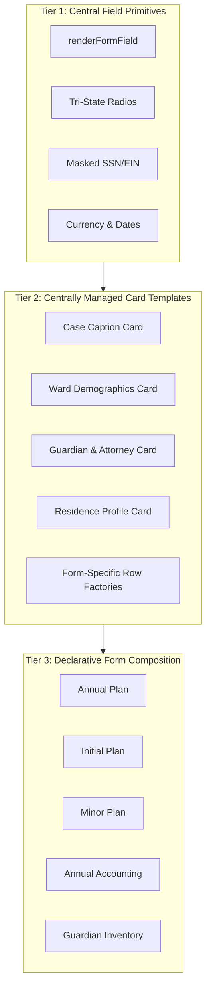

# Milestone 41: Centralized Field Definitions, Shared Card Templates, and Declarative Form Architecture

## Status

**Draft only — do not implement yet.** This proposal outlines an architectural
refactoring to unify form construction across the codebase into a 3-tier
hierarchical system: **Field Primitives $\rightarrow$ Card Templates $\rightarrow$ Form Composition**.
It authorizes no runtime, data-model, test, or documentation change beyond this
proposal.

---

## 1. Architectural Motivation & 3-Tier Hierarchy

Currently, atomic field rendering is partially centralized in
`src/core/form/form-fields.js`, while page layouts and section cards are
interpolated directly into template strings across feature modules (e.g.
`src/features/plan-annual/index.js`, `src/legacy-app.js`).

This milestone proposes establishing a formal 3-tier component architecture:

### Tier 1: Centralized Field Types & Primitives (`src/core/form/form-fields.js`)

- Standardized renderers for text, currency/money, dates, phone, masked SSN/EIN, bar number, and explicit `'Yes'`/`'No'` tri-state radios.
- Unified input attributes: `data-form-path`, `data-field-kind`, `data-field-format-policy`, `aria-describedby`, and accessible labels.
- Integration with formatting engines (`formatPhone`, `formatSSN`, `formatDisplayDate`).

### Tier 2: Globally Managed Card Templates (`src/core/form/cards/`)

- Shared identity and profile cards reused across multiple filings:
  - **Case Caption & Court Identity**: County picker, case number, circuit identification.
  - **Ward Demographics & Inception**: Name, SSN, inception date, reporting period.
  - **Guardian & Attorney Details**: Single/co-guardian identity, bar number, pro se detection.
  - **Residence & Facility Profile**: Living arrangement radios, address, phone, facility type.
- **Form-Specific Row Factories**: In accordance with `AGENTS.md` Section 3, collection grids (e.g. Schedule A assets, Plan Q1 residences) remain driven by form-specific row factories rather than shared generic cards to prevent cross-statute schema pollution.

### Tier 3: Declarative Form Composition (`src/features/*/index.js`)

- Pages assemble layouts by declaring sequences of card components rather than hand-writing inline HTML grids.
- Clean separation between form lifecycle orchestration (mount/dispose/validation) and DOM markup generation.

---

## 2. Cross-Cutting Ramifications (AGENTS.md Section 8 Compliance)

### 2.1 Data Model

- **Persisted Keys**: No change to persisted data keys or paths. State object (`window.D`) remains identical.
- **Schema Single Source of Truth**: All field definitions in Tier 1 must strictly validate against `probate-guardian-data-model.csv`.
- **Validation Script**: Must continue passing `npm run verify:data-model`.

### 2.2 Legacy Data Migration

- **Backward Compatibility**: Fully compatible with existing `.sav` files and legacy global helpers (`inpS`, `txtP`, `radioP`).
- **Bridge Strategy**: Existing legacy helpers will delegate directly to Tier 1 / Tier 2 renderers during the transition phase, ensuring no disruption to un-migrated forms.
- **No Data Loss**: Non-destructive toggling and tri-state values (`''`, `'Yes'`, `'No'`) are enforced at the field primitive level.

### 2.3 Test Coverage & Index Governance

- **New Unit Specs**:
  - `tests/unit/form-fields.spec.js`: Unit tests for all field primitive variants, masking, accessibility attributes, and tri-state radio wrappers.
  - `tests/unit/form-cards.spec.js`: Unit tests verifying that shared card templates bind correctly to `data-form-path` and render required elements.
- **Contract & Regression Specs**:
  - `tests/unit/filing-identity.contract.spec.js`: Verify case caption and identity rendering consistency across all forms.
- **Index Synchronization**: Update `TEST-INDEX.md` in the same commit to track new specs under the appropriate categories.

### 2.4 Export, Import & Portability

- **Parity Invariant**: Field abstractions must not alter output payload structures. PDF, Word/DOCX, and Excel export pipelines rely on direct `window.D` paths (`d.wardName`, `d.caseNumber`, `d.guardians[i]`), which remain untouched.
- **Single-Ward / Full-Case Portability**: JSON export and import routines remain 100% interoperable.

### 2.5 Security & Sensitivity

- **Masking & Reveal**: SSN, EIN, and sensitive account numbers use centralized mask/reveal components (`ssn-mask-wrap`, `ssn-reveal-btn`) with appropriate ARIA accessibility labels.
- **Threat Model**: UI masking prevents accidental shoulder-surfing in shared environments; underlying encryption (`src/core/persistence/`) continues to protect data at rest.

### 2.6 UI/UX & Accessibility Consistency

- **Semantic HTML**: All radio pairs rendered in `<fieldset>` with `<legend>` tags.
- **Label Associations**: All inputs strictly tied to labels via `id` and `for` attributes.
- **Design Consistency**: Reusable cards ensure uniform margins, grid column breakpoints (`col-12 col-md-6`), header typography, and action buttons across all 9 court filings.

### 2.7 Legal & Compliance Framing

- **No Statewide Inference from Local Rules**: County-gated requirements (e.g. Sixth Judicial Circuit service rules) stay isolated in local guidance handlers and are not hardcoded into shared cards.
- **Pro Se & Guardian Advocate Exemptions**: Shared Attorney cards must dynamically adjust requirements so unrepresented filings are never blocked.
